# 市场复盘报告 - 20251031

**生成时间**: 2025-11-01 14:37:16

## 📋 目录

- [📊 市场总结](#-市场总结)
  - [📈 市场情绪综合分析图](#-市场情绪综合分析图)
  - [情绪维度分析](#情绪维度分析)
  - [关键市场指标](#关键市场指标)
    - [市场活跃度](#市场活跃度)
    - [个股赚钱效应](#个股赚钱效应)
    - [风险偏好](#风险偏好)
    - [市场参与意愿](#市场参与意愿)
- [🏢 板块分析](#-板块分析)
- [🎯 个股分析](#-个股分析)
- [⚠️ 风险提示](#️-风险提示)

## 📊 市场总结

**综合情绪指数**: 4.70
**情绪等级**: 中性

### 📈 市场情绪综合分析图

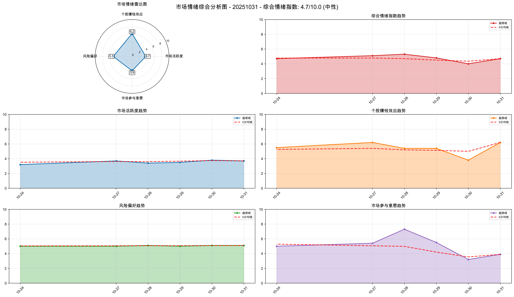

*图表说明：上图展示了20251031的市场情绪综合分析，包括雷达图和趋势分析。*

### 情绪维度分析

| 维度 | 分析结果 |
|------|----------|
| 市场活跃度 | 3.70 |
| 个股赚钱效应 | 6.20 |
| 风险偏好 | 5.10 |
| 市场参与意愿 | 3.90 |

### 关键市场指标

#### 市场活跃度
- **涨停股数量**: 77
- **上涨比例**: 68.57%
- **下跌比例**: 29.01%
- **平盘比例**: 2.21%

#### 个股赚钱效应
- **市场总成交金额**: 23,202 亿元
- **平均流通换手率**: 0.03%
- **各板块成交金额**:
  - 上证主板A: 7,723 亿元
  - 科创板: 2,602 亿元
  - 深证主板A: 6,919 亿元
  - 创业版: 5,958 亿元

#### 风险偏好
- **融资余额**: 24,811 亿元
- **融券余额**: 179 亿元
- **两融余额**: 24,990 亿元
- **平均维持担保比例**: 281.44%
- **两融余额占流通市值占比**: 2.58%

#### 市场参与意愿
- **大单净流入占比**: -1.13%
- **中单净流入占比**: 0.23%
- **小单净流入占比**: 2.74%
- **上证收盘价**: 3954.79
- **上证涨跌幅**: -0.81%

## 🏢 板块分析

### 📊 量价分析

#### 📈 买入信号板块

**信号数量**: 13个

| 排名 | 板块名称 | 量价关系 | 成交量 | 价格 |
|------|----------|----------|--------|------|
| 1 | 影视院线 | 量增价升 | 101.46% | 3.80% |
| 2 | 生物制品 | 量增价升 | 66.92% | 4.09% |
| 3 | 文化传媒 | 量增价升 | 41.10% | 3.35% |
| 4 | 塑料制品 | 量增价升 | 32.12% | 1.23% |
| 5 | 化学制药 | 量增价升 | 27.24% | 3.76% |
| 6 | 白酒 | 量增价升 | 22.80% | 2.06% |
| 7 | 中药 | 量增价升 | 21.93% | 2.16% |
| 8 | 零售 | 量增价升 | 15.67% | 1.20% |
| 9 | 旅游及酒店 | 量增价升 | 13.25% | 1.95% |
| 10 | 其他社会服务 | 量增价升 | 12.27% | 1.60% |
| 11 | 教育 | 量增价升 | 11.62% | 1.77% |
| 12 | 医疗器械 | 量增价升 | 10.70% | 1.99% |
| 13 | 化学制品 | 量增价升 | 10.02% | 1.44% |

#### 📉 卖出信号板块

**信号数量**: 7个

| 排名 | 板块名称 | 量价关系 | 成交量 | 价格 |
|------|----------|----------|--------|------|
| 1 | 半导体 | 量减价跌 | -11.01% | -1.75% |
| 2 | 元件 | 量减价跌 | -13.30% | -1.86% |
| 3 | 通信设备 | 量减价跌 | -22.67% | -1.02% |
| 4 | 小金属 | 量减价跌 | -30.82% | -1.90% |
| 5 | 金属新材料 | 量减价跌 | -40.52% | -1.35% |
| 6 | 煤炭开采加工 | 量减价跌 | -47.08% | -1.19% |
| 7 | 保险 | 量减价跌 | -71.66% | -1.69% |

#### ➡️ 中性信号板块（TOP10）

**总数量**: 7个

| 排名 | 板块名称 | 量价关系 | 成交量 | 价格 |
|------|----------|----------|--------|------|
| 1 | 机场航运 | 量增价平 | 67.66% | -0.30% |
| 2 | 轨交设备 | 量增价平 | 29.94% | -0.51% |
| 3 | 银行 | 量增价平 | 24.82% | -0.07% |
| 4 | 汽车整车 | 量增价平 | 22.34% | 0.97% |
| 5 | 建筑装饰 | 量增价平 | 15.47% | 0.76% |
| 6 | 公路铁路运输 | 量增价平 | 16.13% | -0.07% |
| 7 | 化学纤维 | 量增价平 | 11.48% | 0.14% |

### 📈 MACD分析

#### 📈 买入信号板块

**信号数量**: 3个

| 排名 | 板块名称 | MACD值 | 柱状图 | 信号强度 |
|------|----------|--------|--------|----------|
| 1 | 医疗器械 | 7.4756 | 22.3787 | 29.8543 |
| 2 | 软件开发 | 2.1172 | 10.6860 | 12.8031 |
| 3 | 互联网电商 | 9.5164 | 6.6053 | 16.1217 |

#### 📉 卖出信号板块

**信号数量**: 0个

✅ 暂无卖出信号板块

#### ➡️ 中性信号板块（TOP10）

**总数量**: 87个

| 排名 | 板块名称 | MACD值 | 柱状图 | 信号强度 |
|------|----------|--------|--------|----------|
| 1 | 油气开采及服务 | 18.3045 | -1.3098 | 1.9614 |
| 2 | 工程机械 | 31.8655 | 7.9053 | 19.8854 |
| 3 | 风电设备 | 71.0920 | -18.4140 | 8.9506 |
| 4 | 房地产 | 27.3457 | -1.5176 | 2.8863 |
| 5 | 石油加工贸易 | 23.9467 | 7.4509 | 15.6988 |
| 6 | 银行 | 4.6488 | 0.9056 | 2.7772 |
| 7 | 医药商业 | 7.4805 | 22.0222 | 14.7513 |
| 8 | 教育 | -17.1299 | 13.2740 | 3.0404 |
| 9 | 专用设备 | 75.6212 | 12.1578 | 43.8895 |
| 10 | 小家电 | -9.1623 | 19.5661 | 2.8728 |

### 📸 有买入信号板块综合分析图

**买入信号板块数量**: 15个（量价分析和MACD分析的并集）

#### 其他社会服务

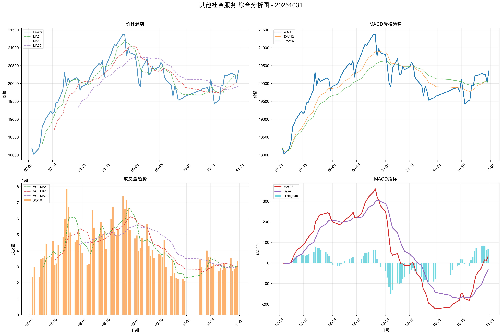

**量价信号**: BUY, **MACD信号**: HOLD, **综合信号强度**: 57.5725

#### 医疗器械

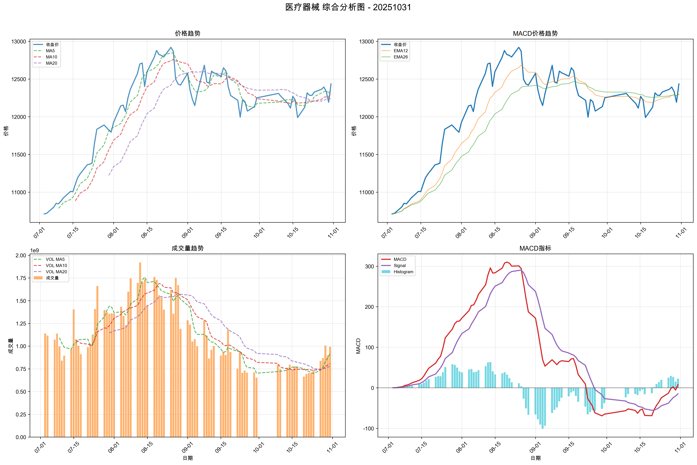

**量价信号**: BUY, **MACD信号**: BUY, **综合信号强度**: 49.7957

#### 塑料制品

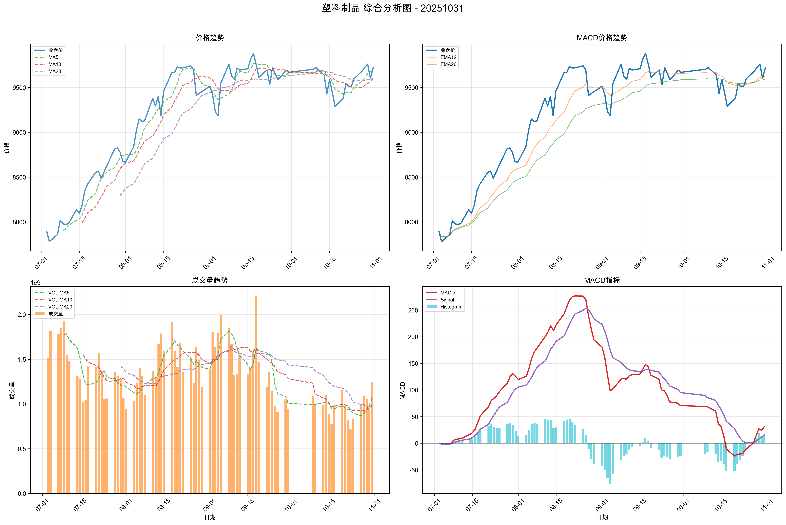

**量价信号**: BUY, **MACD信号**: HOLD, **综合信号强度**: 46.5400

#### 生物制品

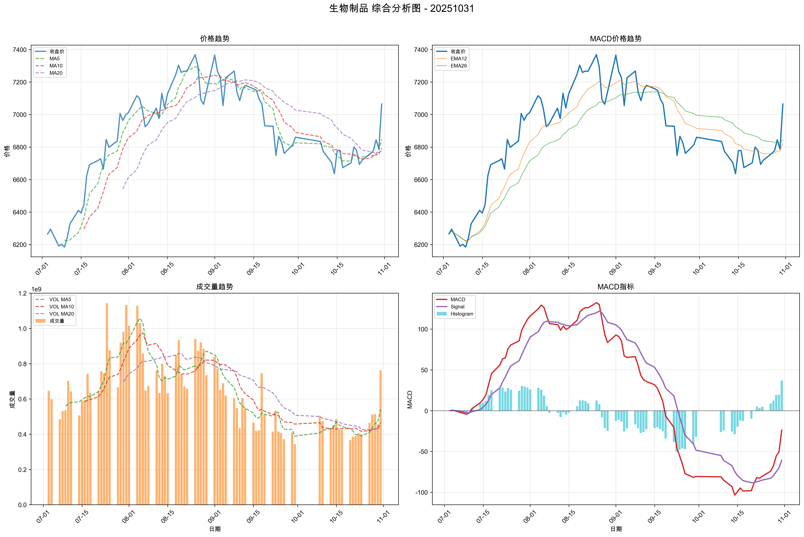

**量价信号**: BUY, **MACD信号**: HOLD, **综合信号强度**: 46.5240

#### 化学制品

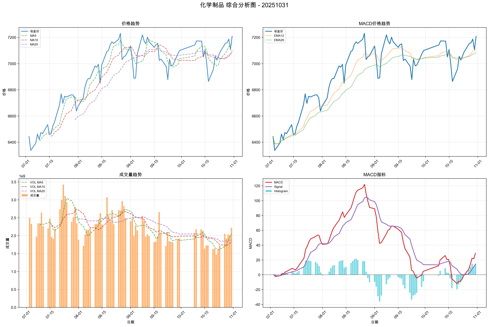

**量价信号**: BUY, **MACD信号**: HOLD, **综合信号强度**: 42.6503

#### 化学制药

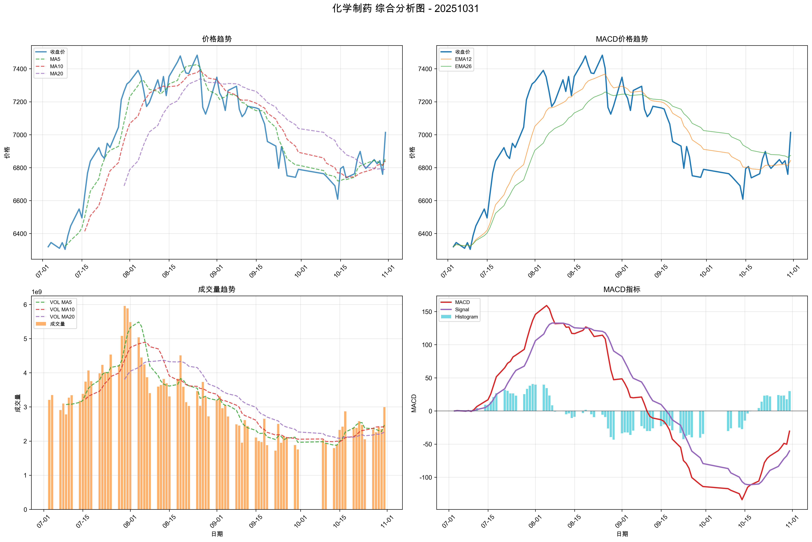

**量价信号**: BUY, **MACD信号**: HOLD, **综合信号强度**: 42.3122

#### 文化传媒

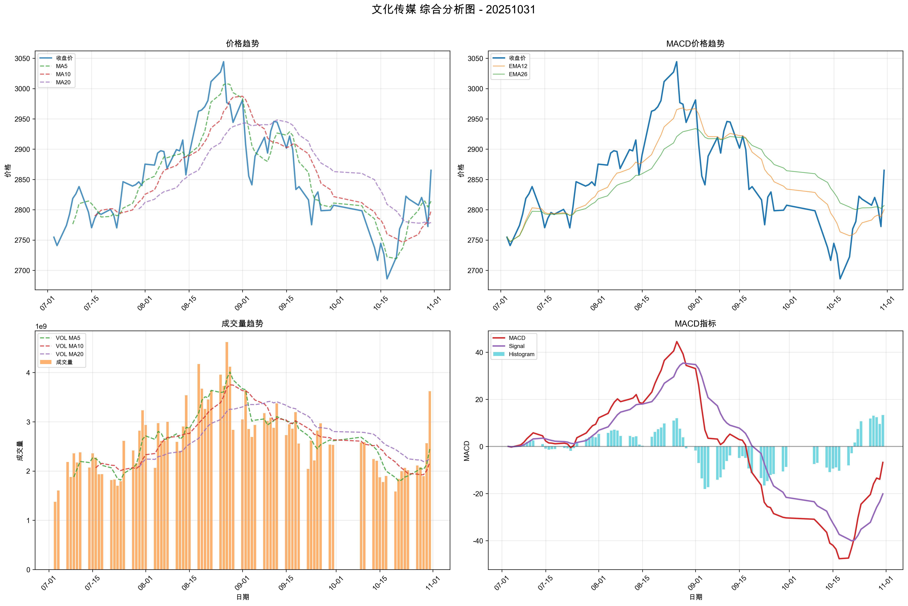

**量价信号**: BUY, **MACD信号**: HOLD, **综合信号强度**: 39.9903

#### 影视院线

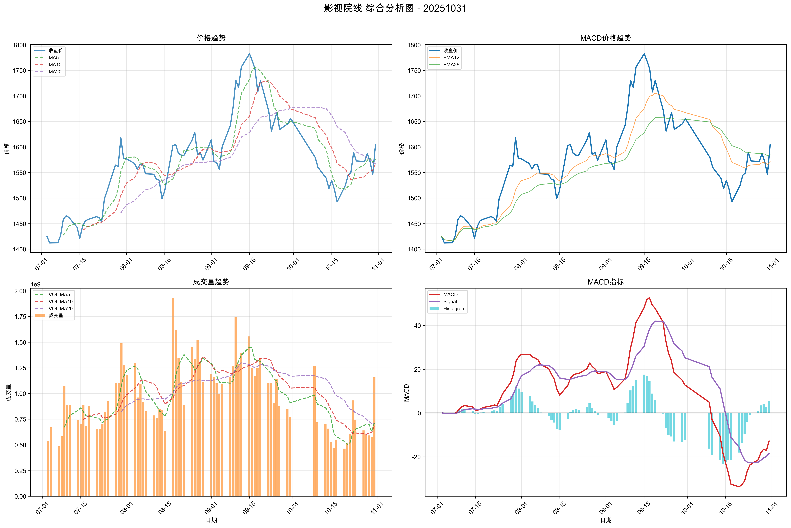

**量价信号**: BUY, **MACD信号**: HOLD, **综合信号强度**: 36.7834

#### 白酒

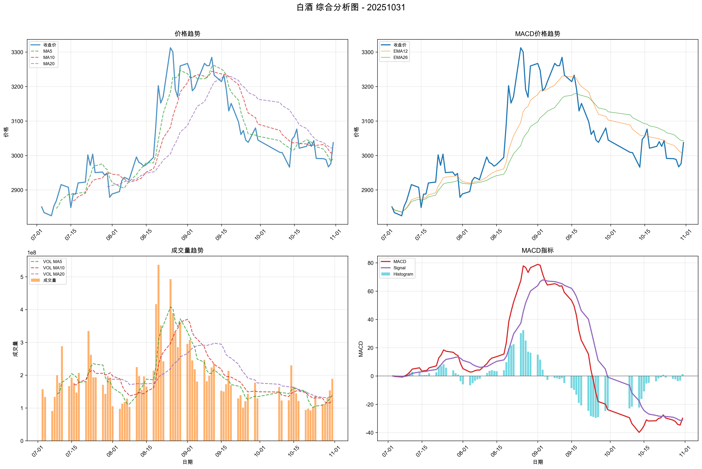

**量价信号**: BUY, **MACD信号**: HOLD, **综合信号强度**: 34.1477

#### 中药

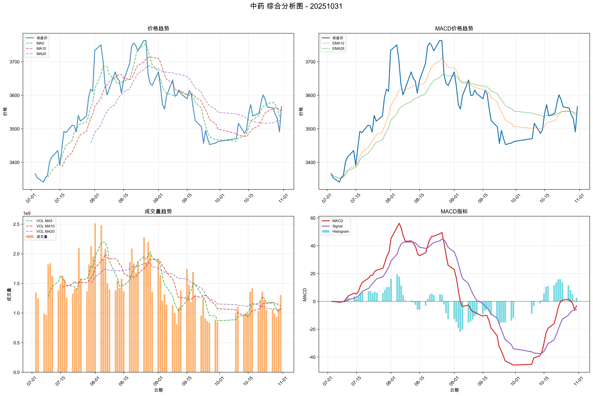

**量价信号**: BUY, **MACD信号**: HOLD, **综合信号强度**: 33.5584

#### 教育

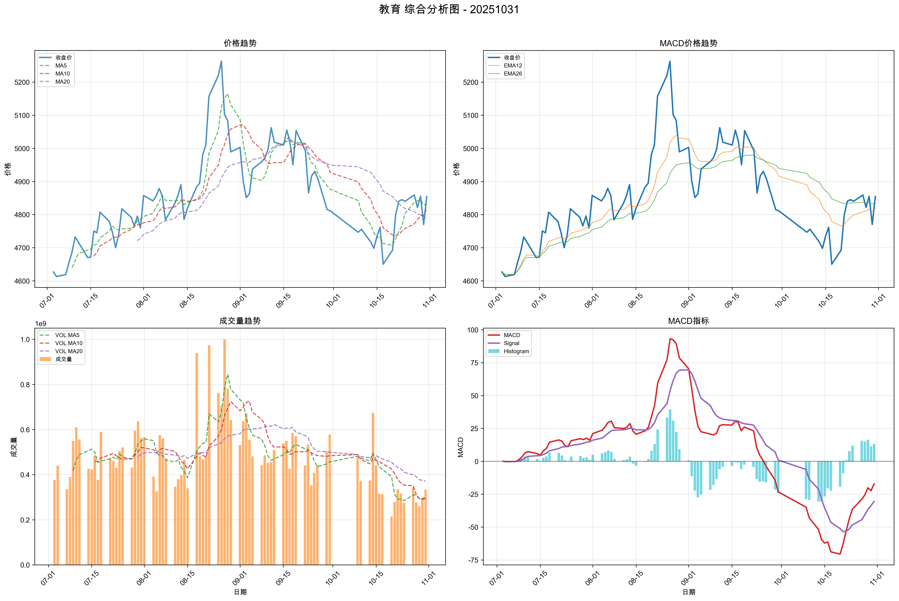

**量价信号**: BUY, **MACD信号**: HOLD, **综合信号强度**: 32.0338

#### 零售

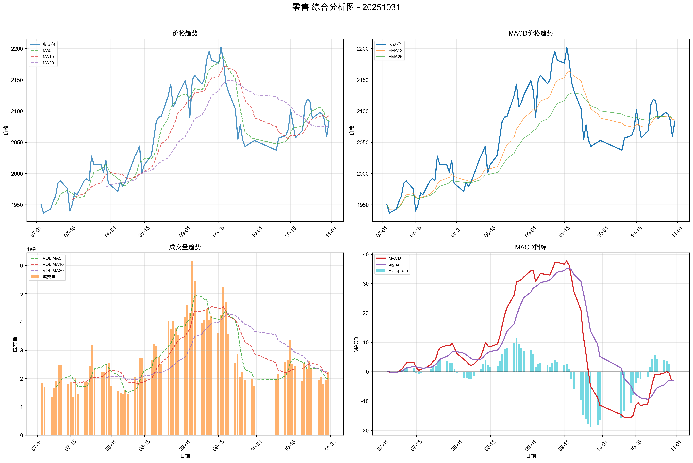

**量价信号**: BUY, **MACD信号**: HOLD, **综合信号强度**: 29.4686

#### 旅游及酒店

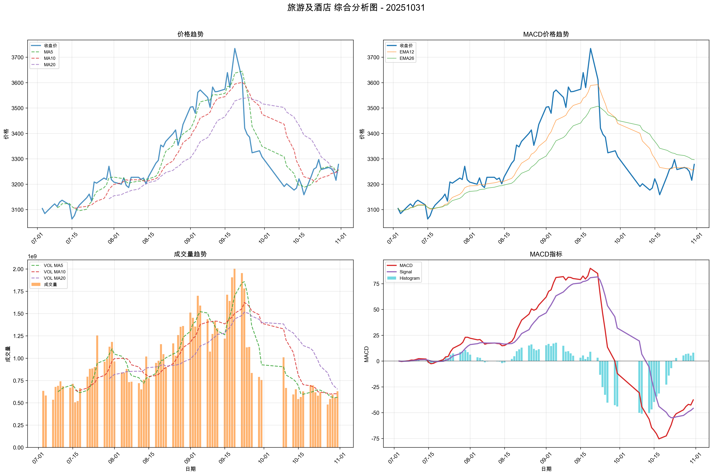

**量价信号**: BUY, **MACD信号**: HOLD, **综合信号强度**: 28.1631

#### 互联网电商

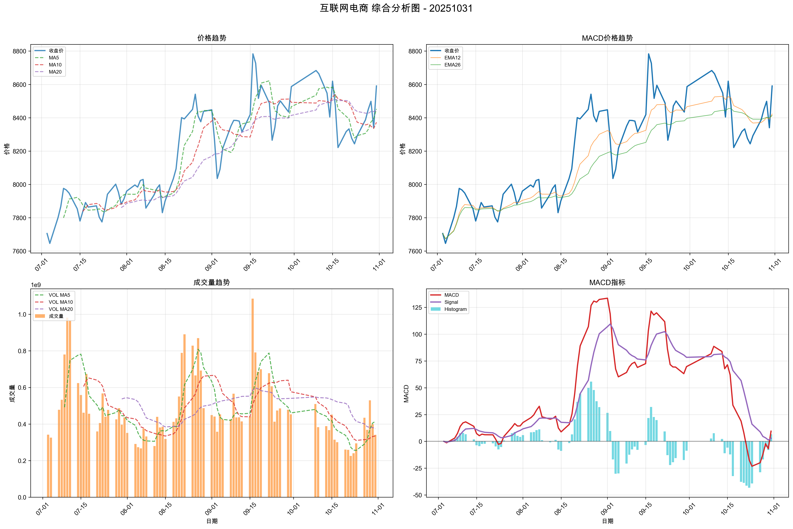

**量价信号**: CAUTION, **MACD信号**: BUY, **综合信号强度**: 23.7954

#### 软件开发

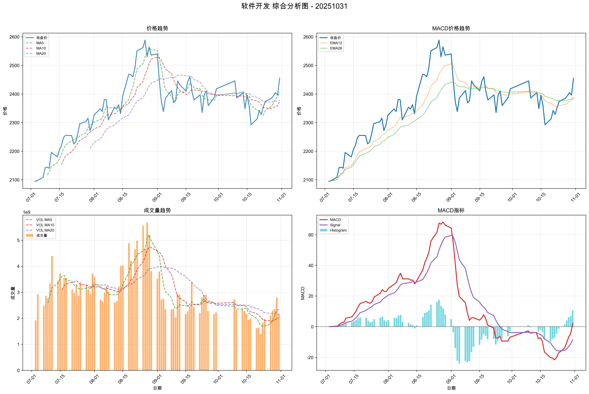

**量价信号**: CAUTION, **MACD信号**: BUY, **综合信号强度**: 20.1203

## 🎯 个股分析

**趋势追踪策略分析**: 1204只股票
**超跌反弹策略分析**: 1204只股票
**分析板块数量**: 15个

**目标板块**: 其他社会服务, 医疗器械, 塑料制品, 生物制品, 化学制品, 化学制药, 文化传媒, 影视院线...

## 📈 趋势追踪策略 - TOP10股票

| 排名 | 股票名称 | 所属板块 | 信号类型 | 趋势状态 | 信号强度 | 最新价 | 趋势强度 |
| --- | --- | --- | --- | --- | --- | --- | --- |
| 1 | 安车检测 | 其他社会服务 | STRONG_BUY | BULLISH | 100.0 | 35.63 | 1.00 |
| 2 | 东富龙 | 医疗器械 | STRONG_BUY | BULLISH | 100.0 | 16.96 | 1.00 |
| 3 | 万盛股份 | 化学制品 | STRONG_BUY | BULLISH | 100.0 | 11.33 | 1.00 |
| 4 | 雅化集团 | 化学制品 | STRONG_BUY | BULLISH | 100.0 | 20.31 | 1.00 |
| 5 | 神州信息 | 互联网电商 | STRONG_BUY | BULLISH | 99.8 | 18.95 | 0.99 |
| 6 | 日辰股份 | 白酒 | STRONG_BUY | BULLISH | 99.4 | 38.40 | 0.97 |
| 7 | 振德医疗 | 医疗器械 | STRONG_BUY | BULLISH | 99.2 | 95.00 | 0.96 |
| 8 | 三生国健 | 生物制品 | STRONG_BUY | BULLISH | 99.1 | 72.96 | 0.96 |
| 9 | 楚天科技 | 医疗器械 | STRONG_BUY | BULLISH | 98.8 | 11.20 | 0.94 |
| 10 | 海峡创新 | 互联网电商 | STRONG_BUY | BULLISH | 98.7 | 10.25 | 0.94 |

## 📉 超跌反弹策略 - TOP10股票

| 排名 | 股票名称 | 所属板块 | 信号类型 | 超跌类型 | 信号强度 | 最新价 | 超跌强度 |
| --- | --- | --- | --- | --- | --- | --- | --- |
| 1 | 新诺威 | 白酒 | BUY | NORMAL_OVERSOLD | 52.7 | 35.40 | 0.39 |
| 2 | 长春高新 | 生物制品 | BUY | NORMAL_OVERSOLD | 52.2 | 112.26 | 0.36 |
| 3 | 赛诺医疗 | 医疗器械 | BUY | NORMAL_OVERSOLD | 51.8 | 21.00 | 0.34 |
| 4 | 实朴检测 | 其他社会服务 | BUY | NORMAL_OVERSOLD | 50.6 | 25.41 | 0.28 |
| 5 | 开立医疗 | 医疗器械 | BUY | NORMAL_OVERSOLD | 50.2 | 28.70 | 0.26 |
| 6 | 奥精医疗 | 医疗器械 | BUY | NORMAL_OVERSOLD | 49.8 | 23.00 | 0.24 |
| 7 | 安杰思 | 医疗器械 | BUY | NORMAL_OVERSOLD | 49.4 | 62.50 | 0.22 |
| 8 | 大博医疗 | 医疗器械 | BUY | NORMAL_OVERSOLD | 49.1 | 50.04 | 0.20 |
| 9 | 圣泉集团 | 化学制品 | BUY | NORMAL_OVERSOLD | 49.0 | 28.01 | 0.20 |
| 10 | 兄弟科技 | 化学制品 | BUY | NORMAL_OVERSOLD | 48.5 | 6.87 | 0.17 |

## 📊 有买入信号股票分析图

以下展示了趋势追踪策略和超跌反弹策略 TOP10 股票的综合分析图（包含量价趋势图和MACD趋势图），按综合信号强度从大到小排列：

### 安车检测 (300572)

**策略类型**: 趋势追踪 | **信号强度**: 100.0

### 雅化集团 (002497)

**策略类型**: 趋势追踪 | **信号强度**: 100.0

### 东富龙 (300171)

**策略类型**: 趋势追踪 | **信号强度**: 100.0

### 万盛股份 (603010)

**策略类型**: 趋势追踪 | **信号强度**: 100.0

### 神州信息 (000555)

**策略类型**: 趋势追踪 | **信号强度**: 99.8

### 日辰股份 (603755)

**策略类型**: 趋势追踪 | **信号强度**: 99.4

### 振德医疗 (603301)

**策略类型**: 趋势追踪 | **信号强度**: 99.2

### 三生国健 (688336)

**策略类型**: 趋势追踪 | **信号强度**: 99.1

### 楚天科技 (300358)

**策略类型**: 趋势追踪 | **信号强度**: 98.8

### 海峡创新 (300300)

**策略类型**: 趋势追踪 | **信号强度**: 98.7

### 新诺威 (300765)

**策略类型**: 超跌反弹 | **信号强度**: 52.7

### 长春高新 (000661)

**策略类型**: 超跌反弹 | **信号强度**: 52.2

### 赛诺医疗 (688108)

**策略类型**: 超跌反弹 | **信号强度**: 51.8

### 实朴检测 (301228)

**策略类型**: 超跌反弹 | **信号强度**: 50.6

### 开立医疗 (300633)

**策略类型**: 超跌反弹 | **信号强度**: 50.2

### 奥精医疗 (688613)

**策略类型**: 超跌反弹 | **信号强度**: 49.8

### 安杰思 (688581)

**策略类型**: 超跌反弹 | **信号强度**: 49.4

### 大博医疗 (002901)

**策略类型**: 超跌反弹 | **信号强度**: 49.1

### 圣泉集团 (605589)

**策略类型**: 超跌反弹 | **信号强度**: 49.0

### 兄弟科技 (002562)

**策略类型**: 超跌反弹 | **信号强度**: 48.5

## ⚠️ 风险提示

本报告仅供学习和研究使用，不构成投资建议。投资有风险，入市需谨慎。
