# 市场复盘报告 - 20251103

**生成时间**: 2025-11-03 22:08:51

## 📋 目录

- [📊 市场总结](#-市场总结)
  - [📈 市场情绪综合分析图](#-市场情绪综合分析图)
  - [关键市场指标](#关键市场指标)
    - [市场活跃度](#市场活跃度)
    - [个股赚钱效应](#个股赚钱效应)
    - [风险偏好](#风险偏好)
    - [市场参与意愿](#市场参与意愿)
- [🏢 板块分析](#-板块分析)
- [🎯 个股分析](#-个股分析)
- [⚠️ 风险提示](#️-风险提示)

## 📊 市场总结

**综合情绪指数**: 4.80
**情绪等级**: 中性

### 📈 市场情绪综合分析图

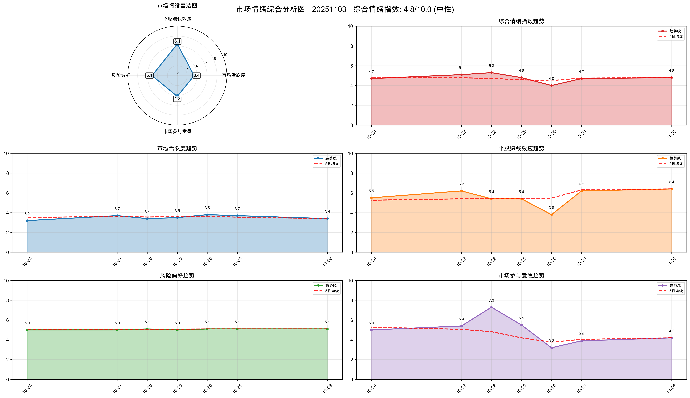

*图表说明：上图展示了20251103的市场情绪综合分析，包括雷达图和趋势分析。*

### 关键市场指标

#### 市场活跃度
- **涨停股数量**: 91
- **上涨比例**: 66.52%
- **下跌比例**: 31.55%
- **平盘比例**: 1.74%

#### 个股赚钱效应
- **市场总成交金额**: 21,094 亿元
- **平均流通换手率**: 2.66%
- **各板块成交金额**:
  - 上证主板A: 7,178 亿元
  - 科创板: 2,250 亿元
  - 深证主板A: 6,257 亿元
  - 创业版: 5,409 亿元

#### 风险偏好
- **融资余额**: 24,688 亿元
- **融券余额**: 175 亿元
- **两融余额**: 24,863 亿元
- **平均维持担保比例**: 280.30%
- **两融余额占流通市值占比**: 2.55%

#### 市场参与意愿
- **大单净流入占比**: -0.82%
- **中单净流入占比**: 0.16%
- **小单净流入占比**: 1.12%
- **上证收盘价**: 3976.52
- **上证涨跌幅**: 0.55%

## 🏢 板块分析

### 📊 量价分析

#### 📈 买入信号板块

**信号数量**: 13个

| 排名 | 板块名称 | 量价关系 | 成交量 | 价格 | 成交额 |
|------|----------|----------|--------|------|-------------|
| 1 | 影视院线 | 量增价升 | 101.46% | 3.80% | 9,984,040,000 |
| 2 | 生物制品 | 量增价升 | 66.92% | 4.09% | 20,059,200,000 |
| 3 | 文化传媒 | 量增价升 | 41.10% | 3.35% | 35,168,600,000 |
| 4 | 塑料制品 | 量增价升 | 32.12% | 1.23% | 17,086,700,000 |
| 5 | 化学制药 | 量增价升 | 27.24% | 3.76% | 58,139,500,000 |
| 6 | 白酒 | 量增价升 | 22.80% | 2.06% | 17,737,100,000 |
| 7 | 中药 | 量增价升 | 21.93% | 2.16% | 13,349,500,000 |
| 8 | 零售 | 量增价升 | 15.67% | 1.20% | 20,180,400,000 |
| 9 | 旅游及酒店 | 量增价升 | 13.25% | 1.95% | 6,298,920,000 |
| 10 | 其他社会服务 | 量增价升 | 12.27% | 1.60% | 4,483,900,000 |
| 11 | 教育 | 量增价升 | 11.62% | 1.77% | 2,591,970,000 |
| 12 | 医疗器械 | 量增价升 | 10.70% | 1.99% | 25,534,500,000 |
| 13 | 化学制品 | 量增价升 | 10.02% | 1.44% | 41,460,900,000 |

#### 📉 卖出信号板块

**信号数量**: 7个

| 排名 | 板块名称 | 量价关系 | 成交量 | 价格 | 成交额 |
|------|----------|----------|--------|------|-------------|
| 1 | 半导体 | 量减价跌 | -11.01% | -1.75% | 182,173,000,000 |
| 2 | 元件 | 量减价跌 | -13.30% | -1.86% | 67,800,200,000 |
| 3 | 通信设备 | 量减价跌 | -22.67% | -1.02% | 108,241,000,000 |
| 4 | 小金属 | 量减价跌 | -30.82% | -1.90% | 31,845,000,000 |
| 5 | 金属新材料 | 量减价跌 | -40.52% | -1.35% | 13,002,900,000 |
| 6 | 煤炭开采加工 | 量减价跌 | -47.08% | -1.19% | 8,964,130,000 |
| 7 | 保险 | 量减价跌 | -71.66% | -1.69% | 2,460,590,000 |

#### ➡️ 中性信号板块（TOP10）

**总数量**: 7个

| 排名 | 板块名称 | 量价关系 | 成交量 | 价格 | 成交额 |
|------|----------|----------|--------|------|-------------|
| 1 | 机场航运 | 量增价平 | 67.66% | -0.30% | 9,613,630,000 |
| 2 | 轨交设备 | 量增价平 | 29.94% | -0.51% | 5,941,290,000 |
| 3 | 银行 | 量增价平 | 24.82% | -0.07% | 39,363,700,000 |
| 4 | 汽车整车 | 量增价平 | 22.34% | 0.97% | 25,719,000,000 |
| 5 | 建筑装饰 | 量增价平 | 15.47% | 0.76% | 40,929,800,000 |
| 6 | 公路铁路运输 | 量增价平 | 16.13% | -0.07% | 6,627,880,000 |
| 7 | 化学纤维 | 量增价平 | 11.48% | 0.14% | 4,529,920,000 |

### 📈 MACD分析

#### 📈 买入信号板块

**信号数量**: 3个

| 排名 | 板块名称 | MACD值 | 柱状图 | 信号强度 | 成交额 |
|------|----------|--------|--------|----------|-------------|
| 1 | 医疗器械 | 6.9606 | 22.6194 | 29.5800 | 25,534,500,000 |
| 2 | 软件开发 | 2.0220 | 10.7305 | 12.7525 | 55,368,800,000 |
| 3 | 互联网电商 | 9.2752 | 6.7144 | 15.9896 | 3,508,120,000 |

#### 📉 卖出信号板块

**信号数量**: 0个

✅ 暂无卖出信号板块

#### ➡️ 中性信号板块（TOP10）

**总数量**: 87个

| 排名 | 板块名称 | MACD值 | 柱状图 | 信号强度 | 成交额 |
|------|----------|--------|--------|----------|-------------|
| 1 | 油气开采及服务 | 18.2824 | -1.3073 | 1.9590 | 5,573,580,000 |
| 2 | 工程机械 | 31.6330 | 8.0013 | 19.8172 | 13,414,800,000 |
| 3 | 风电设备 | 70.7756 | -18.2980 | 8.9074 | 13,635,100,000 |
| 4 | 房地产 | 27.2461 | -1.4827 | 2.8729 | 20,977,300,000 |
| 5 | 石油加工贸易 | 23.8725 | 7.4761 | 15.6743 | 969,670,000 |
| 6 | 银行 | 4.6810 | 0.8887 | 2.7848 | 39,363,700,000 |
| 7 | 医药商业 | 7.4483 | 22.0359 | 14.7421 | 3,080,980,000 |
| 8 | 教育 | -17.1998 | 13.3153 | 3.0515 | 2,591,970,000 |
| 9 | 专用设备 | 75.2502 | 12.3001 | 43.7751 | 37,334,900,000 |
| 10 | 小家电 | -9.3014 | 19.6369 | 2.8938 | 3,988,920,000 |

### 📸 有买入信号板块综合分析图

**买入信号板块数量**: 15个（量价分析和MACD分析的并集）

#### 其他社会服务

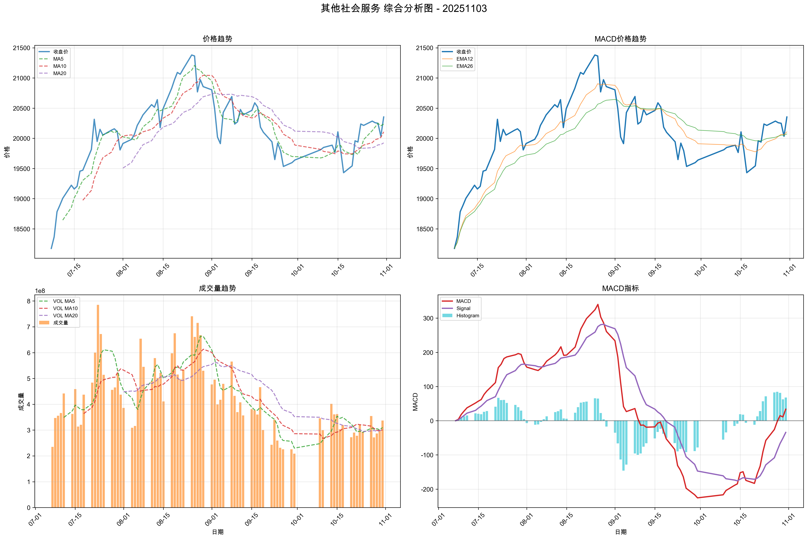

**量价信号**: 买入, **MACD信号**: 持有, **综合信号强度**: 57.4850

#### 医疗器械

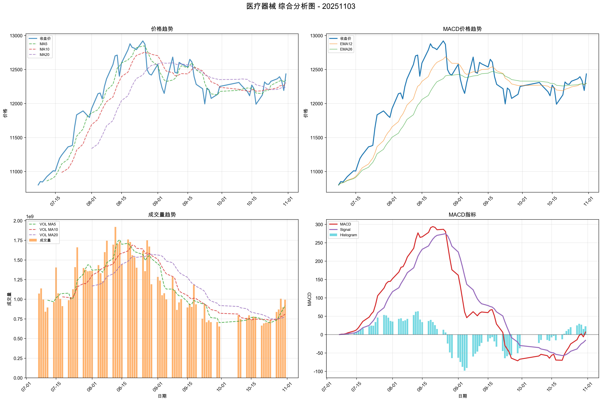

**量价信号**: 买入, **MACD信号**: 买入, **综合信号强度**: 49.6585

#### 生物制品

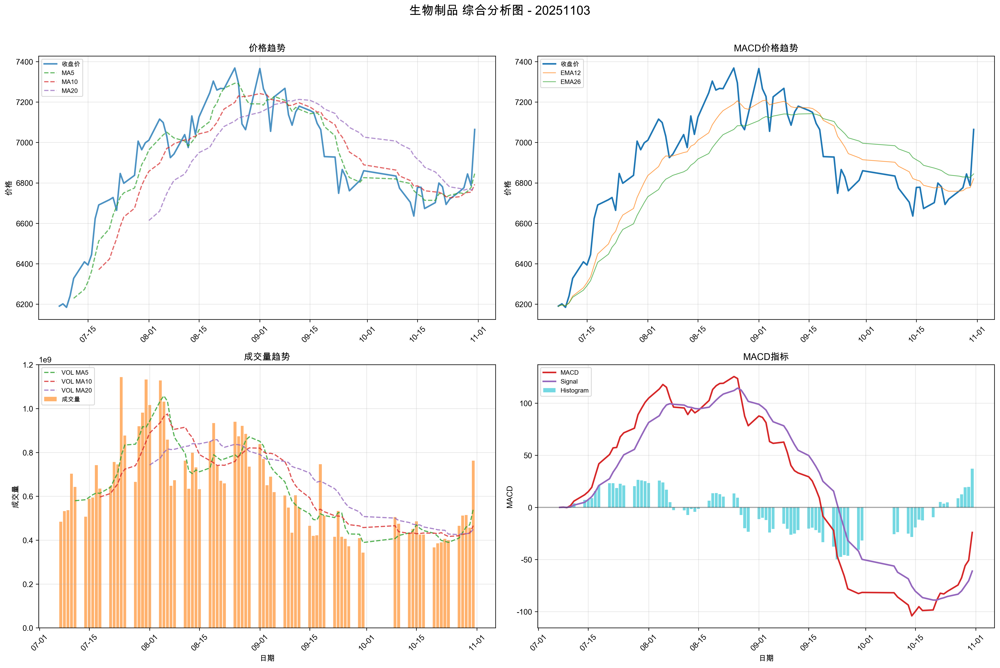

**量价信号**: 买入, **MACD信号**: 持有, **综合信号强度**: 46.5382

#### 塑料制品

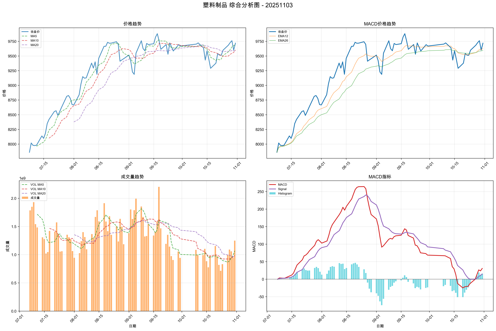

**量价信号**: 买入, **MACD信号**: 持有, **综合信号强度**: 46.4607

#### 化学制品

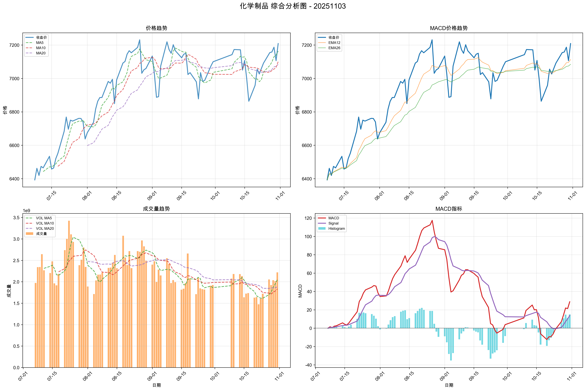

**量价信号**: 买入, **MACD信号**: 持有, **综合信号强度**: 42.6172

#### 化学制药

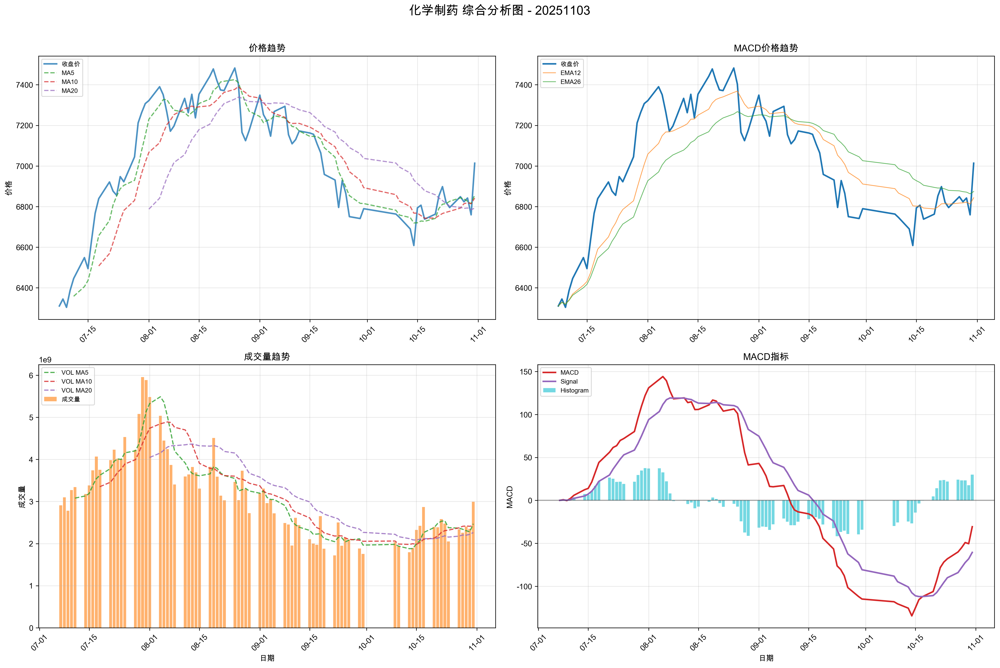

**量价信号**: 买入, **MACD信号**: 持有, **综合信号强度**: 42.3260

#### 文化传媒

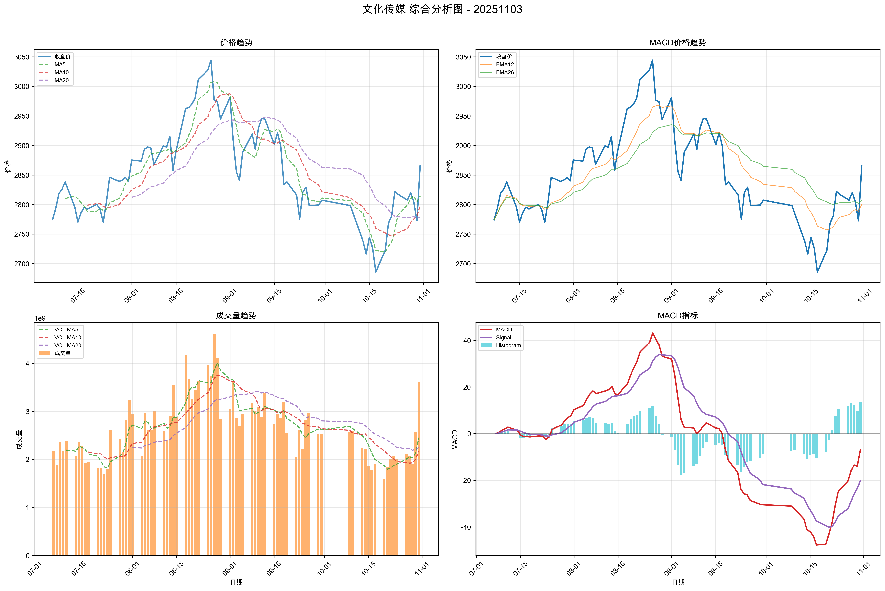

**量价信号**: 买入, **MACD信号**: 持有, **综合信号强度**: 39.9919

#### 影视院线

**量价信号**: 买入, **MACD信号**: 持有, **综合信号强度**: 36.7877

#### 白酒

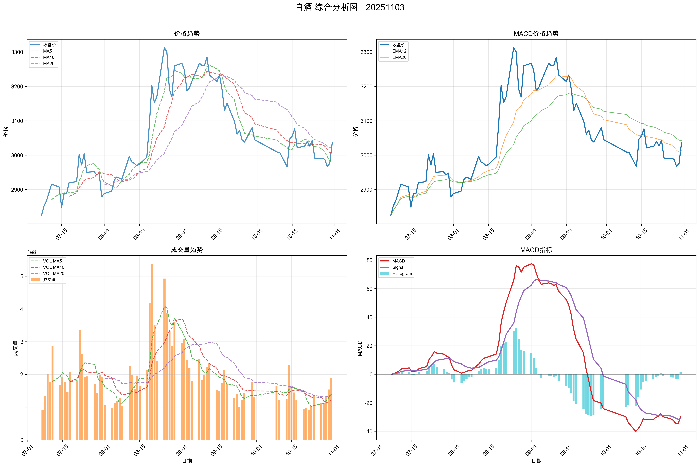

**量价信号**: 买入, **MACD信号**: 持有, **综合信号强度**: 34.1532

#### 中药

**量价信号**: 买入, **MACD信号**: 持有, **综合信号强度**: 33.5630

#### 教育

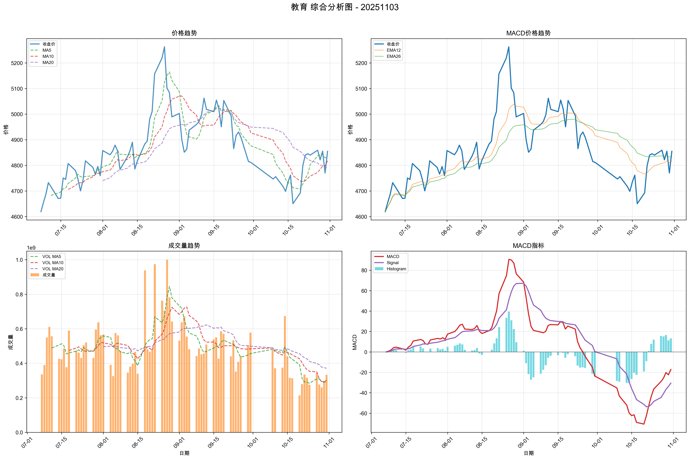

**量价信号**: 买入, **MACD信号**: 持有, **综合信号强度**: 32.0394

#### 零售

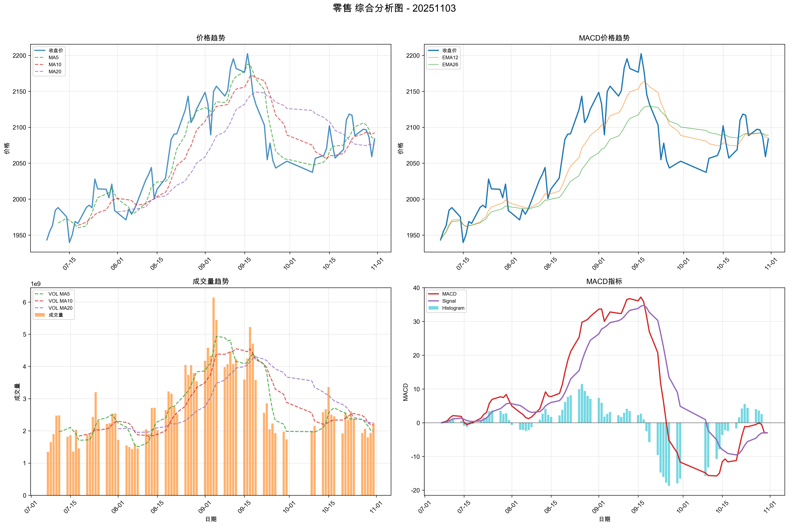

**量价信号**: 买入, **MACD信号**: 持有, **综合信号强度**: 29.4722

#### 旅游及酒店

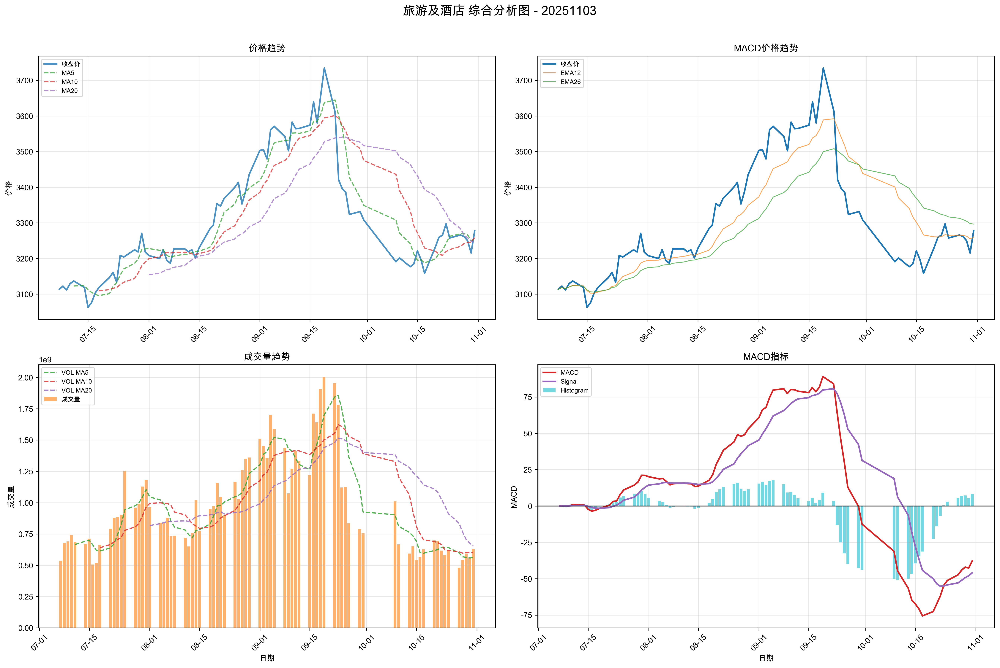

**量价信号**: 买入, **MACD信号**: 持有, **综合信号强度**: 28.1688

#### 互联网电商

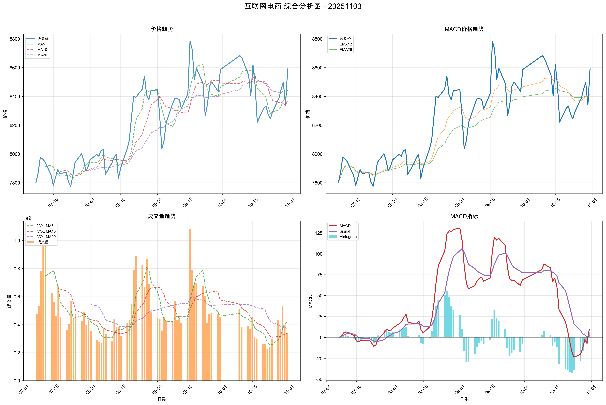

**量价信号**: 谨慎, **MACD信号**: 买入, **综合信号强度**: 23.7293

#### 软件开发

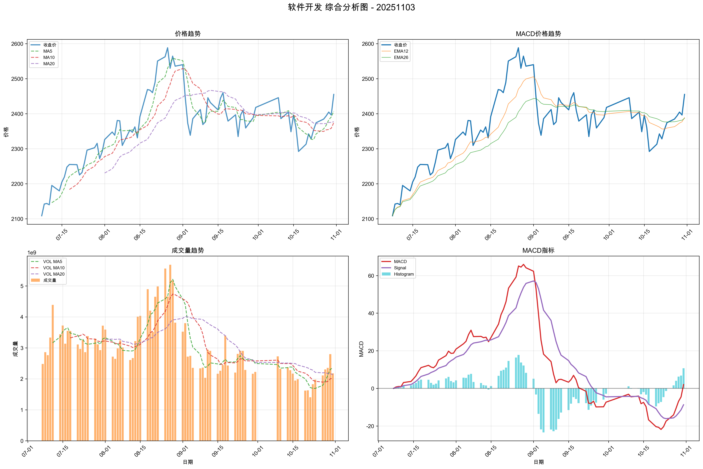

**量价信号**: 谨慎, **MACD信号**: 买入, **综合信号强度**: 20.0949

## 🎯 个股分析

**趋势追踪策略分析**: 1204只股票
**超跌反弹策略分析**: 1204只股票
**分析板块数量**: 15个

**目标板块**: 其他社会服务, 医疗器械, 生物制品, 塑料制品, 化学制品, 化学制药, 文化传媒, 影视院线...

## 📌 重点关注股票分析

**重点关注股票总数**: 4 只
**成功分析**: 4 只

| 股票名称 | 最新价 | MACD状态 | 趋势状态 | 信号类型 | 量价关系 | 价格变化% | 成交量变化% | 量价信号 |
| --- | --- | --- | --- | --- | --- | --- | --- | --- |
| 银之杰(300085) | 47.60 | 看跌 | 看跌 | 卖出 | 量平价平 | 0.38% | -9.74% | 未知 |
| 高新发展(000628) | 50.11 | 看跌 | 看跌 | 卖出 | 量平价平 | 0.24% | -1.51% | 未知 |
| 信维通信(300136) | 37.34 | 看涨 | 看涨 | 强烈买入 | 量平价升 | 4.39% | 7.14% | 持有 |
| 汇金股份(300368) | 18.05 | 中性 | 横盘 | 持有 | 量平价升 | 1.46% | -3.14% | 持有 |

## 📈 趋势追踪策略 - TOP10股票

| 排名 | 股票名称 | 所属板块 | 信号类型 | 趋势状态 | 信号强度 | 最新价 | 趋势强度 |
| --- | --- | --- | --- | --- | --- | --- | --- |
| 1 | 东富龙 | 医疗器械 | 强烈买入 | 看涨 | 100.0 | 17.99 | 1.00 |
| 2 | 三生国健 | 生物制品 | 强烈买入 | 看涨 | 100.0 | 78.71 | 1.00 |
| 3 | 浙江龙盛 | 化学制品 | 强烈买入 | 看涨 | 100.0 | 10.80 | 1.00 |
| 4 | 万盛股份 | 化学制品 | 强烈买入 | 看涨 | 100.0 | 11.53 | 1.00 |
| 5 | 永冠新材 | 化学制品 | 强烈买入 | 看涨 | 100.0 | 18.80 | 1.00 |
| 6 | 雅化集团 | 化学制品 | 强烈买入 | 看涨 | 100.0 | 20.29 | 1.00 |
| 7 | 常山药业 | 化学制药 | 强烈买入 | 看涨 | 100.0 | 69.80 | 1.00 |
| 8 | 康芝药业 | 化学制药 | 强烈买入 | 看涨 | 100.0 | 9.02 | 1.00 |
| 9 | 捷成股份 | 影视院线, 文化传媒 | 强烈买入 | 看涨 | 100.0 | 6.85 | 1.00 |
| 10 | 天下秀 | 影视院线, 文化传媒 | 强烈买入 | 看涨 | 100.0 | 6.83 | 1.00 |

## 📉 超跌反弹策略 - TOP10股票

| 排名 | 股票名称 | 所属板块 | 信号类型 | 超跌类型 | 信号强度 | 最新价 | 超跌强度 |
| --- | --- | --- | --- | --- | --- | --- | --- |
| 1 | 长春高新 | 生物制品 | 买入 | 一般超跌 | 52.4 | 108.22 | 0.37 |
| 2 | 赛诺医疗 | 医疗器械 | 买入 | 一般超跌 | 52.1 | 21.42 | 0.35 |
| 3 | 新诺威 | 白酒 | 买入 | 一般超跌 | 52.1 | 35.18 | 0.35 |
| 4 | 开立医疗 | 医疗器械 | 买入 | 一般超跌 | 49.5 | 28.88 | 0.22 |
| 5 | 钢研纳克 | 其他社会服务 | 买入 | 一般超跌 | 48.6 | 17.16 | 0.18 |
| 6 | 安杰思 | 医疗器械 | 买入 | 一般超跌 | 48.5 | 62.85 | 0.17 |
| 7 | 圣泉集团 | 化学制品 | 买入 | RSI_REBOUND | 34.4 | 27.23 | 0.22 |
| 8 | 实朴检测 | 其他社会服务 | 买入 | RSI_REBOUND | 33.6 | 26.92 | 0.18 |
| 9 | 兄弟科技 | 化学制品 | 买入 | RSI_REBOUND | 33.6 | 6.84 | 0.18 |
| 10 | 迈瑞医疗 | 医疗器械 | 持有 | 无 | 30.7 | 212.01 | 0.29 |

## 📊 有买入信号股票分析图

以下展示了趋势追踪策略和超跌反弹策略 TOP10 股票的综合分析图（包含量价趋势图和MACD趋势图），按综合信号强度从大到小排列：

### 三生国健 (688336)

**策略类型**: 趋势追踪 | **信号强度**: 100.0

### 康芝药业 (300086)

**策略类型**: 趋势追踪 | **信号强度**: 100.0

### 捷成股份 (300182)

**策略类型**: 趋势追踪 | **信号强度**: 100.0

### 天下秀 (600556)

**策略类型**: 趋势追踪 | **信号强度**: 100.0

### 雅化集团 (002497)

**策略类型**: 趋势追踪 | **信号强度**: 100.0

### 永冠新材 (603681)

**策略类型**: 趋势追踪 | **信号强度**: 100.0

### 浙江龙盛 (600352)

**策略类型**: 趋势追踪 | **信号强度**: 100.0

### 万盛股份 (603010)

**策略类型**: 趋势追踪 | **信号强度**: 100.0

### 常山药业 (300255)

**策略类型**: 趋势追踪 | **信号强度**: 100.0

### 东富龙 (300171)

**策略类型**: 趋势追踪 | **信号强度**: 100.0

### 长春高新 (000661)

**策略类型**: 超跌反弹 | **信号强度**: 52.4

### 赛诺医疗 (688108)

**策略类型**: 超跌反弹 | **信号强度**: 52.1

### 新诺威 (300765)

**策略类型**: 超跌反弹 | **信号强度**: 52.1

### 开立医疗 (300633)

**策略类型**: 超跌反弹 | **信号强度**: 49.5

### 钢研纳克 (300797)

**策略类型**: 超跌反弹 | **信号强度**: 48.6

### 安杰思 (688581)

**策略类型**: 超跌反弹 | **信号强度**: 48.5

### 圣泉集团 (605589)

**策略类型**: 超跌反弹 | **信号强度**: 34.4

### 实朴检测 (301228)

**策略类型**: 超跌反弹 | **信号强度**: 33.6

### 兄弟科技 (002562)

**策略类型**: 超跌反弹 | **信号强度**: 33.6

### 迈瑞医疗 (300760)

**策略类型**: 超跌反弹 | **信号强度**: 30.7

## ⚠️ 风险提示

本报告仅供学习和研究使用，不构成投资建议。投资有风险，入市需谨慎。
